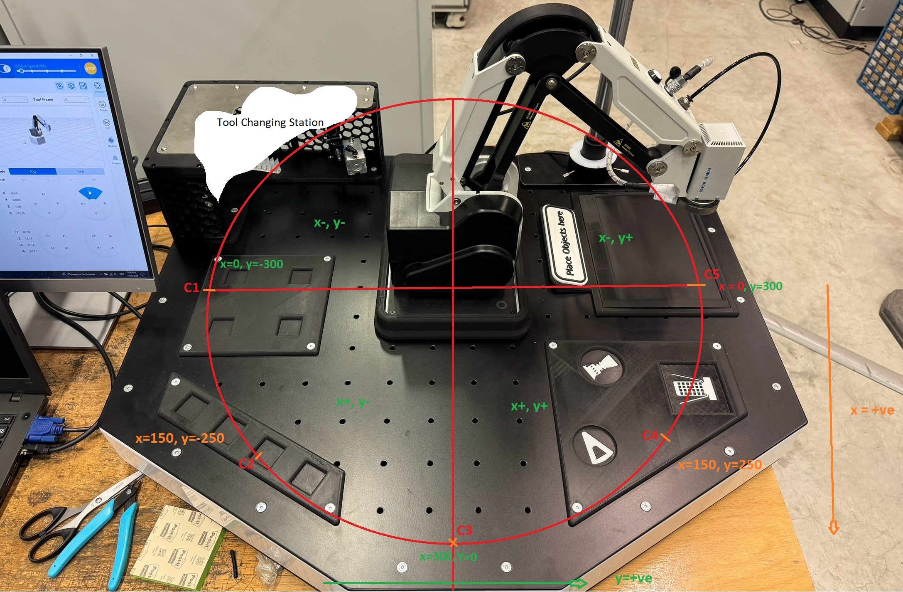

# Optimal-Path-Traversal-for-the-Dobot-MG400

## Overview
Developed a rule-based path planning algorithm for the Dobot MG400 to enable safe traversal between arbitrary positions while avoiding self-collisions.

The system dynamically generates intermediate waypoints based on quadrant transitions, ensuring collision-free motion within constrained workspaces.

---

## Key Features
- Collision-aware path planning using quadrant-based logic
- Dynamic waypoint generation between arbitrary poses
- Safe traversal across robot workspace
- Real-world implementation on Dobot MG400
- Pre-defined objects in the workspace can also be accounted for

---

## Problem Statement
Direct linear motion between two points can lead to:
- Self-collisions
- Workspace violations
- Unsafe robot configurations
- Often, the robot was detection a possible collisions several dozen lines in advance and would prompt an error
- this made debugging really time-consuming

This project very simply improves this by introducing structured intermediate waypoints.

---

## Approach

The workspace is divided into quadrants:
- Q1: (+x, +y)
- Q2: (-x, +y)
- Q3: (-x, -y)
- Q4: (+x, -y)

Path selection is based on:
- Initial position quadrant
- Final position quadrant

Intermediate waypoints are introduced to ensure safe traversal.

---

## Example Logic

```lua
if initialPos[1] < 0 and initialPos[2] < 0 and finalPos[1] < 0 and finalPos[2] > 0 then
    waypoints = {initialPos, coordinate1, coordinate2, coordinate3, coordinate4, coordinate5, finalPos}
end
```

## Media

### Mapping



